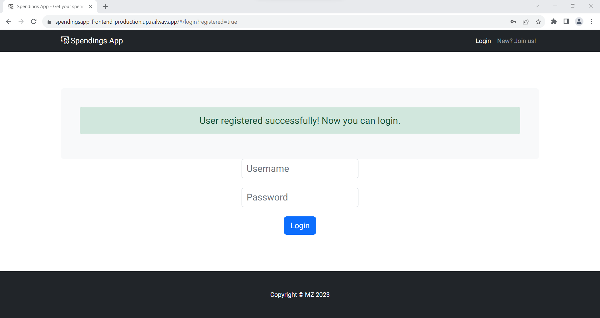
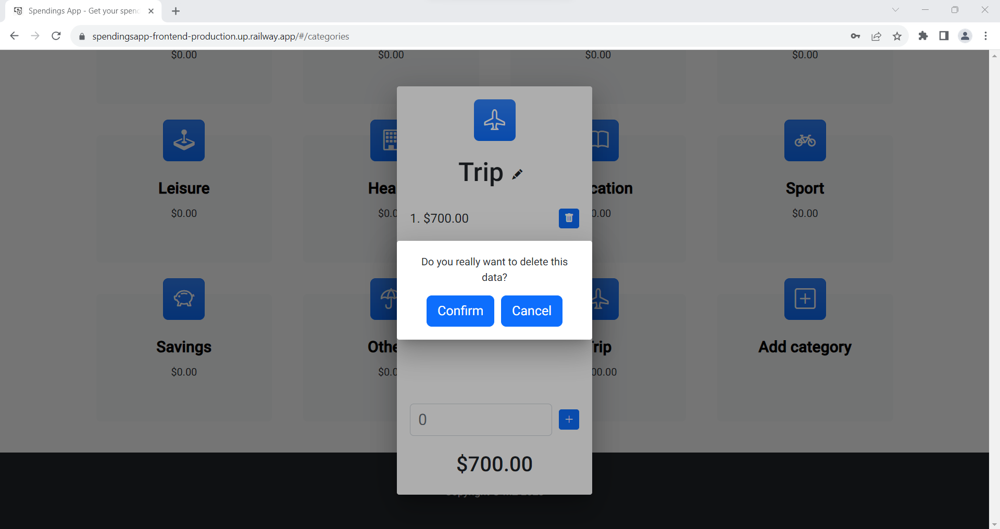

# SpendingsApp

App available [here](https://spendingsapp-frontend-production.up.railway.app/ "Hogwarts Student Management System").

SpendingsApp is a web application that allows users to track their finances. Users can input data about all their incomes and spendings, categorized by month. The spendings are further categorized; each user receives a set of default categories after creating an account. These categories can be customized according to preferences. Below, in the "How to Use" section, screenshots of the working app with a brief explanation are displayed.

## How to use

After clicking the link above, a user sees a login page.


To create a new account, choose a link in the top right corner, "New? Join us!" or a link below the login panel, "Register." The view below is shown.


Fill in the form and agree to the Terms and Conditions and the Privacy Policy.



You will be redirected to the login page. Now you can log in with a newly created account. A page with your incomes and spending categories will be displayed.


You can use arrows next to the date to change the month and see your finances for that month. Total income and Total spendings refer to the currently shown month, and the Balance shows your total balance from all the provided data. Click "Add income," type in an amount, and press the "+" sign. The income will be added.


To close the popup window, click outside of it. To add a custom category, scroll down and click the "Add category" button.


Type in a name and choose an icon using arrows.


Then confirm with the "Save" button. A new category will be created, and now you can click on it to add some spendings, the same way as with incomes.


To delete a spending, click a trash bin icon next to a spending and confirm.



To change the category name or image, click a pen icon next to the category name.


You can also delete a category by clicking a trash bin icon next to the category name in the edit category panel. After confirming, the category will be deleted. All the added spendings and incomes are calculated, and Total income, Total spendings, and Balance are updated. If spendings in the current month are higher than incomes, the Total spendings' font turns red. Also, if the Balance is below 0, it turns red.


To log out, click the "Logout" link in the upper right corner.


## Built with
- Java version 17
- Apache Maven 4.0.0
- Spring Boot 3.1.0
- Angular 16.0.0
- Typescript 5.0.2

## Running
Before running te app locally, all the urls have to be adjusted to your local server.

Go to **/SpendingsApp/backend** directory and run:

```bash
mvn clean spring-boot:run
```

then go to **/SpendingsApp/frontend** directory and run:

```bash
ng serve
```
